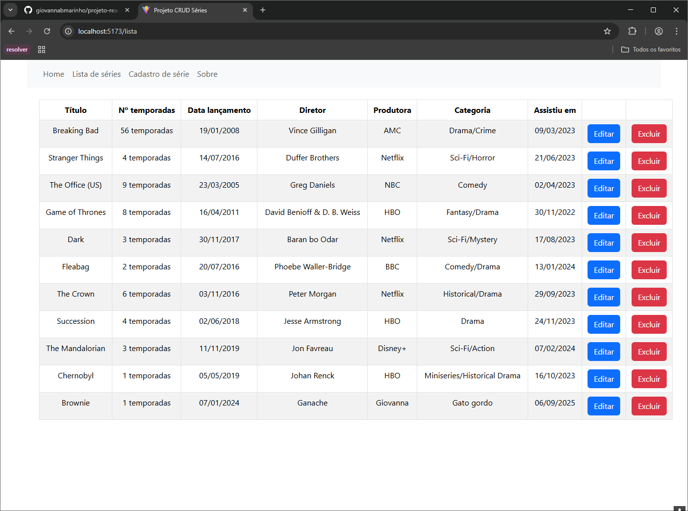
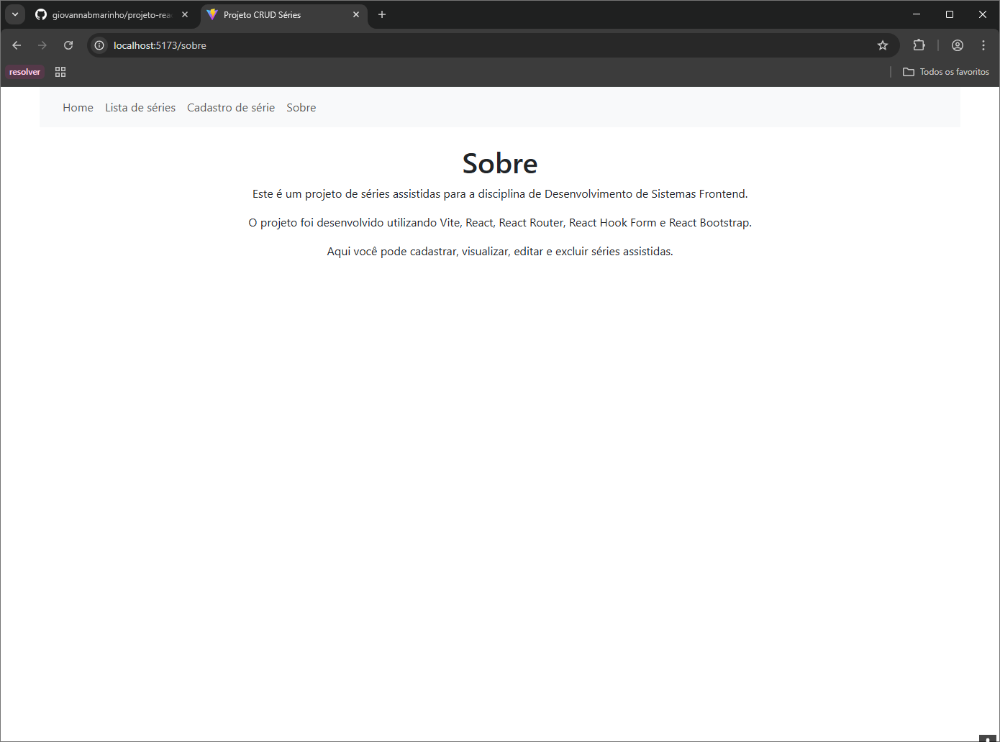

## Nome: `Giovanna Barbosa Marinho`

Para executar este projeto:

1. Rode npm install para instalar as dependências do projeto:


```
npm install
```

3. E em seguida, npm start, para iniciar a execução do projeto.

```
npm run dev
```
4. Acesse a url disponibilizada pelo vite em seu navegador

```
http://localhost:5173
```

5. Executar testes:
```
npm run test
```

Após execução do projeto, este é o resultado esperado no navegador:





## Introdução

Este projeto contém uma estrutura básica a partir do template Vite, sem muitas alterações, com o objetivo de demostrar como compartilhar o estado de uma aplicação utilizando Vite, React, React Router e React Hook Form.

### Atualização:

Para a segunda parte deste projeto, foram feitas as seguintes adições:
- Bootstrap utilizando a biblioteca [react-bootstrap](https://react-bootstrap.netlify.app/)
- Integração com uma [api](https://github.com/adsPucrsOnline/DesenvolvimentoFrontend/tree/main/serieJournal-api) rodando localmente para realizar as operações CRUD com as séries
- Testes básicos de componentes utilizando [Vitest](https://vitest.dev/)

## Componentes

Os componentes estão no diretório `./src/components`:
- Home:
  - Descrição: este componente contém apenas alguns textos para recepcionar o usuário ao projeto.

- Navbar:
  - Descrição: este componente utiliza NavLink do React Router para mostrar apresentar uma barra de navegação para as páginas do projeto.

- SerieForm:
  - Descrição: este componente renderiza um formulário para cadastro ou edição de séries. Os dados s"ao obtidos e salvos no localStorage do navegador. É verificado se um param id existe na url para considerar se é uma edição de uma série já existente ou se é uma adição de uma nova série. Aqui é utilizado React Hook Form para auxiliar no lógica do formulário. Caso o usuário não saiba todas as informações no momento, a validação do form obriga apenas que os campos de nome da série e data em que assistiu sejam obrigatórios (o usuário pode editar estes dados posteriormente). Após salvar o formulário, o usuário é redirecionadao para a SerieList.

- SerieList:
  - Descrição: Este componente oobtém as séries salvas no localStorage para exibí-las em uma lista, com a opção de navegar para a edição da série, ou deletar a série.

- Sobre:
  - Descrição: este componente apenas contém alguns textos informativos sobre o projeto.

## Conclusão

Este projeto é apenas para fins demonstrativos e não contém mais alterações do que as necessárias para demostrar algumas funcionalidades úteis para o desenvolvimento de projetos em ReactJS e integraçao com api.